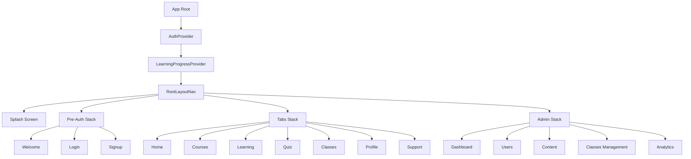
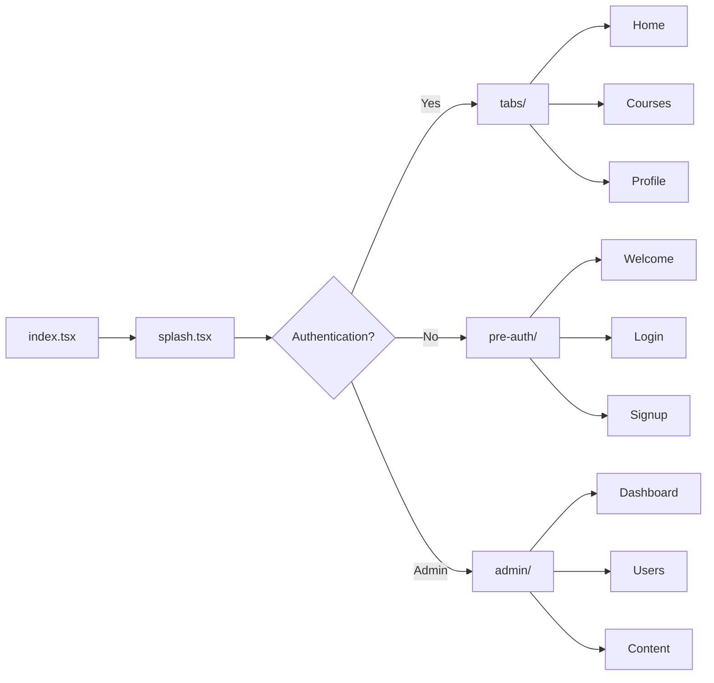
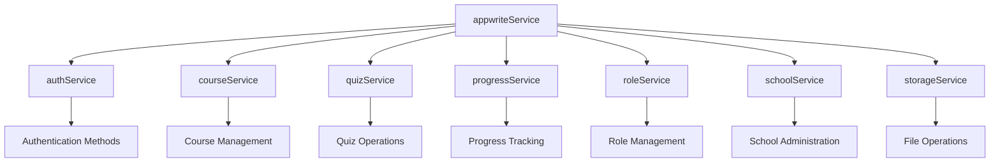
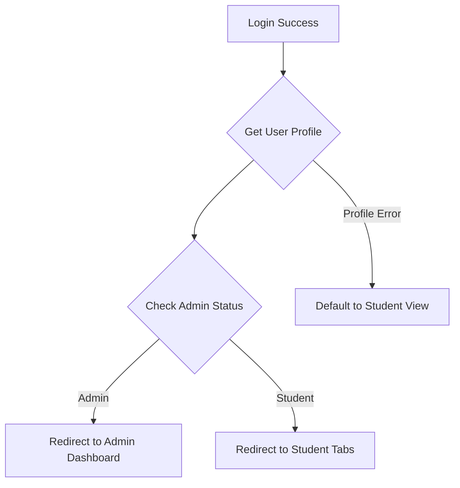

# End-to-End Project Completion Design

## Overview

This design document outlines the completion strategy for the React Native Expo-based language learning application, addressing missing implementations, fixing identified issues, and ensuring full end-to-end functionality.

### Current State Analysis
- **Technology Stack**: React Native with Expo SDK 53, TypeScript, Tailwind CSS via NativeWind
- **Backend**: Appwrite cloud services for authentication, database, and storage
- **Architecture**: File-based routing with modular component structure
- **Status**: Partially implemented with several placeholder screens and incomplete modules

## Technology Stack & Dependencies

### Core Framework
- **React Native**: 0.79.5 with React 19.0.0
- **Expo SDK**: 53.0.17 for cross-platform development
- **Navigation**: expo-router for file-based routing
- **Styling**: TailwindCSS + NativeWind for consistent design

### Backend Integration
- **Appwrite**: 18.1.1 for authentication, database, and storage
- **State Management**: React Context API for auth and learning progress
- **Data Persistence**: AsyncStorage for offline capabilities

## Component Architecture

### Core UI Components Structure



### Component Hierarchy

#### Navigation Structure
```
RootLayout
├── SplashScreen (Initial loading)
├── PreAuthStack
│   ├── WelcomeScreen
│   ├── LoginScreen
│   └── SignupScreen
├── TabsStack (Authenticated Users)
│   ├── HomeScreen
│   ├── CoursesStack
│   ├── LearningStack
│   ├── QuizStack
│   ├── ClassesStack
│   ├── ProfileStack
│   └── SupportStack
└── AdminStack (Admin Users)
    ├── AdminDashboard
    ├── UserManagement
    ├── ContentManagement
    ├── ClassesManagement
    └── Analytics
```

#### UI Component Library
```
components/
├── ui/ (Core Components)
│   ├── Button (Primary, Secondary, Outline variants)
│   ├── Card (Elevated, Flat variants)
│   ├── Typography (H1-H6, Body, Caption)
│   └── Header (App header with navigation)
└── ui2/ (Advanced Components)
    ├── Form Components (Input, Select, Checkbox)
    ├── Navigation (Tabs, Drawer, Breadcrumb)
    ├── Data Display (Table, List, Badge)
    └── Feedback (Toast, Modal, Alert)
```

## Routing & Navigation

### File-based Routing Structure



### Navigation Flow Implementation
- **Initial Route**: `/` → Redirects to `/splash`
- **Splash Screen**: Authentication check → Route to appropriate stack
- **Protected Routes**: Auth-gated access to tabs and admin sections
- **Public Routes**: Pre-auth screens accessible without authentication

## State Management

### Authentication Context
```typescript
interface AuthContextType {
  user: User | null;
  isLoading: boolean;
  isAuthenticated: boolean;
  login: (email: string, password: string) => Promise<void>;
  signup: (email: string, password: string, name: string) => Promise<boolean>;
  logout: () => Promise<void>;
  resetPassword: (email: string) => Promise<void>;
}
```

### Learning Progress Context
```typescript
interface LearningProgressState {
  lessons: Record<string, LessonProgress>;
  vocabulary: Record<string, VocabularyStat>;
  exercises: Record<string, ExerciseResult>;
  overallCompletion: number;
  streakDays: number;
  // State mutators
  markLessonStarted: (lessonId: string, courseId?: string) => void;
  updateLessonProgress: (lessonId: string, percent: number) => void;
  markLessonCompleted: (lessonId: string) => void;
  recordVocabularyResult: (term: string, correct: boolean) => void;
  recordExerciseAttempt: (id: string, type: string, success: boolean) => void;
  resetAll: () => void;
}
```

## API Integration Layer

### Appwrite Service Architecture



### Service Integration Points
- **Authentication**: User login, signup, profile management
- **Course Management**: CRUD operations for courses and lessons
- **Progress Tracking**: Learning analytics and completion tracking
- **Quiz System**: Question management and attempt recording
- **Role Management**: Admin and user permission handling
- **Storage**: Media upload and file management

## Issues Identified & Solutions

### 1. Missing Environment Configuration

**Issue**: No `.env` file for Appwrite configuration
**Solution**: Create environment configuration system

```typescript
// Environment Configuration
interface AppConfig {
  APPWRITE_ENDPOINT: string;
  APPWRITE_PROJECT_ID: string;
  APPWRITE_DATABASE_ID: string;
  APPWRITE_STORAGE_BUCKET_ID: string;
}
```

### 2. Incomplete Screen Implementations

**Issue**: Multiple screens contain only placeholder content
**Affected Screens**:
- Support/Help screens
- Settings screens
- Admin content management
- Video player implementation
- Quiz interface

**Solution**: Complete implementations with full functionality

### 3. Missing Data Models

**Issue**: Incomplete TypeScript interfaces for data structures
**Solution**: Define comprehensive data models

```typescript
interface Course {
  $id: string;
  title: string;
  description: string;
  level: 'beginner' | 'intermediate' | 'advanced';
  duration: number;
  instructor: string;
  lessons: Lesson[];
  createdAt: string;
  updatedAt: string;
}

interface Lesson {
  $id: string;
  courseId: string;
  title: string;
  content: string;
  videoUrl?: string;
  duration: number;
  order: number;
  exercises: Exercise[];
}

interface Quiz {
  $id: string;
  title: string;
  description: string;
  questions: Question[];
  timeLimit?: number;
  passingScore: number;
}
```

### 4. Authentication Flow Issues

**Issue**: Incomplete admin role detection and routing
**Solution**: Enhanced role-based navigation



### 5. Missing Error Handling

**Issue**: Limited error boundaries and user feedback
**Solution**: Comprehensive error handling strategy

```typescript
interface ErrorBoundaryState {
  hasError: boolean;
  error?: Error;
  errorInfo?: string;
}

// Global error handling for:
// - Network failures
// - Authentication errors
// - Data loading errors
// - Navigation errors
```

## Completion Roadmap

### Phase 1: Core Infrastructure
1. **Environment Configuration**
   - Create `.env.example` with required variables
   - Implement configuration management
   - Add environment validation

2. **Data Models Enhancement**
   - Complete TypeScript interfaces
   - Add validation schemas
   - Implement data transformation utilities

3. **Error Handling Implementation**
   - Add global error boundary
   - Implement retry mechanisms
   - Create user-friendly error messages

### Phase 2: Authentication & User Management
1. **Complete Authentication Flow**
   - Enhance role detection
   - Implement profile completion
   - Add account verification

2. **Admin User Management**
   - Complete user listing and details
   - Implement role assignment
   - Add user analytics

### Phase 3: Content Management
1. **Course Management System**
   - Complete course creation workflow
   - Implement lesson management
   - Add content upload functionality

2. **Quiz System Enhancement**
   - Complete quiz builder
   - Implement question types
   - Add attempt tracking and analytics

### Phase 4: Learning Experience
1. **Video Player Implementation**
   - Integrate expo-video
   - Add playback controls
   - Implement progress tracking

2. **Interactive Learning Features**
   - Complete exercise implementations
   - Add vocabulary tracking
   - Implement streak calculations

### Phase 5: Analytics & Reporting
1. **Learning Analytics Dashboard**
   - Student progress visualization
   - Course completion metrics
   - Quiz performance analytics

2. **Admin Analytics**
   - User engagement metrics
   - Content performance analysis
   - System usage statistics

## Testing Strategy

### Unit Testing Focus Areas
- **Authentication Service**: Login/logout flows
- **Course Service**: CRUD operations
- **Progress Tracking**: State calculations
- **Navigation**: Route transitions

### Integration Testing
- **Authentication Flow**: End-to-end user journey
- **Content Management**: Admin workflows
- **Learning Progress**: Cross-service data consistency

### Performance Testing
- **App Launch Time**: Splash to dashboard transition
- **Data Loading**: Course and quiz data fetching
- **Offline Functionality**: Local storage and sync

## Deployment Considerations

### Environment Setup
- Development, staging, and production configurations
- Appwrite project setup for each environment
- CI/CD pipeline for automated builds

### Platform Optimization
- iOS and Android specific configurations
- Web platform compatibility
- Performance optimization for each platform

### Monitoring & Analytics
- Crash reporting integration
- User analytics tracking
- Performance monitoring setup