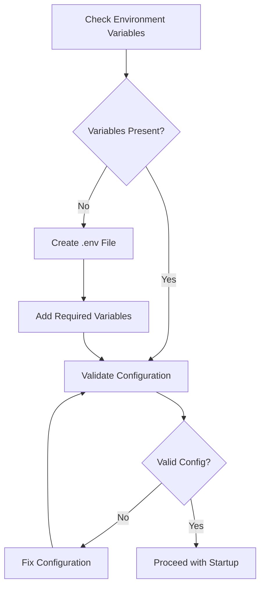
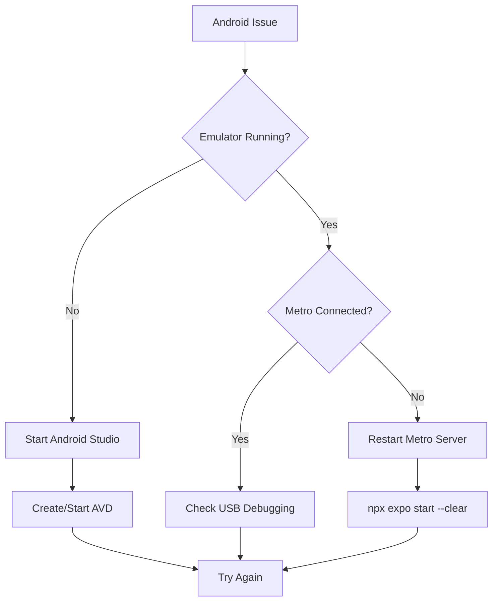

# Project Startup and Issue Resolution Guide

## Overview

This document provides a comprehensive guide for running the React Native Expo project and systematically addressing potential issues that may arise during startup and development. The project is an educational platform built with React Native, Expo, and Appwrite backend services.

## Architecture

### Technology Stack
- **Frontend Framework**: React Native 0.79.5 with React 19.0.0
- **Development Platform**: Expo SDK 53.0.17
- **Routing**: Expo Router (file-based routing)
- **Styling**: Tailwind CSS with NativeWind
- **Backend**: Appwrite (authentication, database, storage)
- **State Management**: React Context API
- **Language**: TypeScript 5.8.3

### Project Structure
```
react_tutorial/
├── app/                    # Main application screens
│   ├── (admin)/           # Admin interface screens
│   ├── (pre-auth)/        # Authentication screens
│   ├── (tabs)/            # Tab-based navigation
│   └── auth/              # Auth flow screens
├── components/            # Reusable UI components
│   ├── ui/               # Basic UI components
│   └── ui2/              # Advanced UI components
├── lib/                  # Utility functions and config
├── services/             # Backend service integrations
└── scripts/              # Database setup scripts
```

## Startup Procedures

### Prerequisites Check
Before running the project, verify the following requirements:

| Requirement | Version | Command to Check |
|-------------|---------|------------------|
| Node.js | 16.x or higher | `node --version` |
| npm | Latest | `npm --version` |
| Expo CLI | Latest | `expo --version` |
| Git | Any recent | `git --version` |

### Environment Configuration

#### Required Environment Variables
The project requires Appwrite configuration through environment variables:

```bash
APPWRITE_ENDPOINT=https://your-appwrite-instance.com/v1
APPWRITE_PROJECT_ID=your-project-id
APPWRITE_DATABASE_ID=your-database-id
APPWRITE_STORAGE_BUCKET_ID=your-storage-bucket-id
```

#### Environment Setup Flow


### Startup Commands

#### Development Environment
```bash
# Install dependencies
npm install

# Start development server
npm start
# or
npx expo start

# Platform-specific startup
npm run android    # Android emulator
npm run ios        # iOS simulator
npm run web        # Web browser
```

#### Development Server Options
- **QR Code**: Scan with Expo Go app
- **Press 'a'**: Open Android emulator
- **Press 'i'**: Open iOS simulator
- **Press 'w'**: Open in web browser

## Common Issues and Solutions

### Issue Category 1: Environment Configuration

#### Missing Environment Variables
**Symptoms:**
- Error: "Missing required environment variable: APPWRITE_ENDPOINT"
- Application crashes on startup

**Solution:**
```bash
# Create .env file in project root
touch .env

# Add required variables
echo "APPWRITE_ENDPOINT=https://cloud.appwrite.io/v1" >> .env
echo "APPWRITE_PROJECT_ID=your-project-id" >> .env
echo "APPWRITE_DATABASE_ID=your-database-id" >> .env
echo "APPWRITE_STORAGE_BUCKET_ID=your-storage-bucket-id" >> .env
```

#### Invalid Appwrite Configuration
**Symptoms:**
- Network connection errors
- Authentication failures
- Database access denied

**Diagnostic Steps:**
1. Verify Appwrite instance is running
2. Check project ID exists in Appwrite console
3. Validate database and storage bucket IDs
4. Ensure API keys have proper permissions

### Issue Category 2: Dependency Problems

#### Node Modules Installation Failures
**Symptoms:**
- npm install errors
- Missing dependency warnings
- Version conflicts

**Solution Strategy:**
```bash
# Clean installation
rm -rf node_modules package-lock.json
npm cache clean --force
npm install

# For persistent issues
npx expo install --fix
```

#### Expo CLI Issues
**Symptoms:**
- Command not found: expo
- Expo version mismatch

**Resolution:**
```bash
# Install/update Expo CLI
npm install -g @expo/cli

# Verify installation
expo --version

# Login to Expo (if needed)
expo login
```

### Issue Category 3: Platform-Specific Problems

#### Android Emulator Issues
**Common Problems:**
- Emulator not starting
- App not installing on device
- Metro bundler connection issues

**Troubleshooting:**


#### iOS Simulator Issues
**Common Problems:**
- Simulator not found
- Build failures on iOS
- Provisioning profile issues

**Resolution Steps:**
1. Ensure Xcode is installed and updated
2. Open Xcode and accept license agreements
3. Install iOS simulators through Xcode preferences
4. Reset simulator if needed: Device > Erase All Content and Settings

### Issue Category 4: Runtime Errors

#### Authentication Service Failures
**Symptoms:**
- Login/signup not working
- User session not persisting
- Role detection failures

**Debugging Approach:**
```typescript
// Check Appwrite connection in browser console
import { account } from './services/appwrite/client';

// Test connection
account.get()
  .then(user => console.log('User:', user))
  .catch(error => console.error('Auth Error:', error));
```

#### Database Connection Issues
**Symptoms:**
- Failed to fetch data
- Collection not found errors
- Permission denied errors

**Solution Process:**
1. Verify collection IDs in `lib/config.ts`
2. Check database permissions in Appwrite console
3. Run collection setup script: `node scripts/create-appwrite-collections.js`
4. Validate user roles and permissions

### Issue Category 5: Build and Performance

#### Metro Bundler Problems
**Symptoms:**
- Bundle loading stuck
- JavaScript heap out of memory
- Slow bundling performance

**Optimization Steps:**
```bash
# Clear Metro cache
npx expo start --clear

# Reset bundler
npx expo r --clear

# Increase Node.js memory
export NODE_OPTIONS="--max-old-space-size=8192"
npx expo start
```

#### Memory and Performance Issues
**Monitoring Tools:**
- React DevTools for component analysis
- Flipper for React Native debugging
- Chrome DevTools for web debugging

## Monitoring and Diagnostics

### Health Check Procedures

#### System Status Verification


#### Logging Configuration
The application implements comprehensive logging:
- Environment validation errors
- Appwrite service errors
- Authentication flow tracking
- Component error boundaries

### Performance Monitoring

#### Key Metrics to Track
- App startup time
- Screen transition speed
- API response times
- Memory usage patterns
- Battery consumption

#### Monitoring Implementation
```typescript
// Performance tracking example
const startTime = performance.now();
// App operation
const endTime = performance.now();
console.log(`Operation took ${endTime - startTime} milliseconds`);
```

## Development Workflow

### Safe Development Practices

#### Code Quality Gates
- ESLint configuration active
- TypeScript strict mode enabled
- Component error boundaries implemented
- Comprehensive error handling

#### Testing Strategy
- Component unit testing
- Integration testing with Appwrite
- User flow testing
- Cross-platform compatibility testing

### Continuous Integration Setup

#### Pre-commit Checks
```bash
# Lint code
npm run lint

# Type checking
npx tsc --noEmit

# Test build
npx expo export
```

## Emergency Procedures

### Critical Issue Response

#### Application Crash Resolution
1. **Immediate Actions:**
   - Check error logs and stack traces
   - Verify environment configuration
   - Restart development server

2. **Systematic Debugging:**
   - Isolate problematic component/service
   - Test with minimal configuration
   - Check recent code changes

#### Service Outage Handling
1. **Appwrite Service Down:**
   - Check Appwrite status page
   - Implement offline mode if available
   - Notify users of service issues

2. **Build Service Failures:**
   - Switch to local development
   - Check Expo service status
   - Use alternative build methods

### Recovery Procedures

#### Data Recovery
- User progress backup strategies
- Course content backup procedures
- Configuration restore processes

#### Rollback Strategies
- Version control best practices
- Environment rollback procedures
- Database migration rollbacks